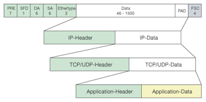
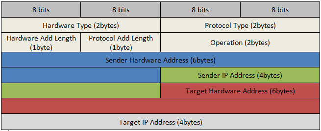

.. contents::

.. numbers::

Ethernet packet frame
=====================

ARP packet
==========

Determinate MAC address based on existing IP address.
+-------------------------+--------------+
| On image                | Description  |
+=========================+==============+
| Sender Hardware Address | sender MAC   |
+-------------------------+--------------+
| Sender IP Address       | sender IP    |
+-------------------------+--------------+
| Target Hardware Address | All zero     |
+-------------------------+--------------+
| Target IP Address       | receiver IP  |
+-------------------------+--------------+

